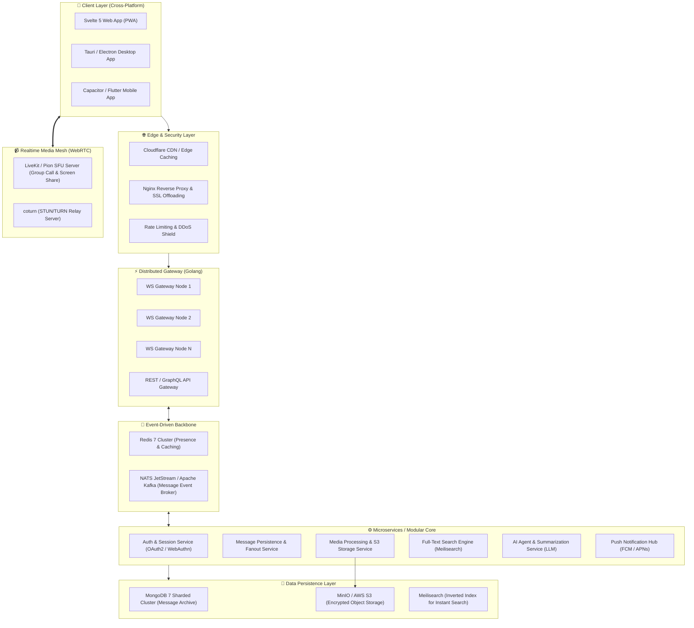

# 🚀 LỘ TRÌNH PHÁT TRIỂN NÂNG CAO & BẢN ĐỒ KIẾN TRÚC HỆ THỐNG CHAT ENTERPRISE
> **Cấp độ:** Production / Enterprise Grade  
> **Nền tảng hiện tại:** Svelte 5 + Golang + Redis 7 + MongoDB 7 + WebRTC  
> **Định hướng tiến hóa:** Super-App Giao tiếp thời gian thực, Bảo mật E2EE, Tích hợp AI, Hạ tầng phân tán đa cụm (Distributed Cluster) chịu tải hàng triệu kết nối.

---

## 📑 MỤC LỤC
1. [Tầm nhìn & Mục tiêu Phát triển Hệ thống](#1-tam-nhin--muc-tieu)
2. [Sơ đồ Kiến trúc Tổng thể Đích đến (Enterprise Architecture)](#2-so-do-kien-truc)
3. [Bản đồ 10 Đại Phân hệ Tính Năng Nâng Cao](#3-ban-do-10-dai-phan-he)
4. [Lộ trình Triển khai Chi tiết: Giai đoạn 11 đến 20 (Stage 11 -> Stage 20)](#4-lo-trinh-trien-khai-chi-tiet)
5. [Ma trận Đánh giá Mức độ Ưu tiên (Impact vs. Effort Matrix)](#5-ma-tran-uu-tien)
6. [Chiến lược Hạ tầng & Dự toán Mở rộng Quy mô (Capacity & Scaling)](#6-chien-luoc-ha-tang)

---

<a name="1-tam-nhin--muc-tieu"></a>
## 1. 🎯 Tầm nhìn & Mục tiêu Phát triển Hệ thống

Hiện tại hệ thống đã hoàn thành nền tảng vững chắc (Giai đoạn 1 – 10) với nhắn tin 1-1, chat nhóm, gửi đa phương tiện, ghi âm, tương tác tin nhắn, cuộc gọi P2P WebRTC 1-1 và đóng gói Docker.

**Mục tiêu của giai đoạn nâng cao:**
- **Bảo mật tối thượng:** Triển khai mã hóa đầu cuối (E2EE) chuẩn quân đội, bảo vệ quyền riêng tư người dùng tuyệt đối.
- **Quy mô lớn (High Scalability):** Nâng cấp từ P2P sang **SFU Media Server** cho cuộc gọi nhóm hàng trăm người; chuyển đổi WebSocket Hub sang cụm phân tán **Distributed Gateway + Message Broker (NATS / Kafka)**.
- **Trí tuệ nhân tạo (GenAI Native):** Biến khung chat thành trung tâm năng suất với trợ lý AI tóm tắt thảo luận, dịch thuật thời gian thực, chuyển đổi giọng nói thành văn bản và Smart Reply.
- **Trải nghiệm mượt mà Offline-First:** Tích hợp Local Storage Engine (SQLite WASM / IndexedDB) đảm bảo trải nghiệm nhắn tin không độ trễ ngay cả khi mất mạng đột ngột.
- **Hệ sinh thái mở (Extensibility):** Hỗ trợ Bot API, Webhooks và nền tảng Mini-Apps tương tự Telegram / Discord.

---

<a name="2-so-do-kien-truc"></a>
## 2. 🏛️ Sơ đồ Kiến trúc Tổng thể Đích đến (Enterprise Architecture)



---

<a name="3-ban-do-10-dai-phan-he"></a>
## 3. 🧩 Bản đồ 10 Đại Phân hệ Tính Năng Nâng Cao

### 🛡️ Phân hệ 1: Bảo Mật, Quyền Riêng Tư & Mã Hóa Đầu Cuối (E2EE)
- **Mã hóa E2EE (End-to-End Encryption):** Áp dụng thuật toán Signal Protocol (Double Ratchet + X3DH) cho hội thoại 1-1 và MLS (Messaging Layer Security) cho nhóm. Server chỉ đóng vai trò trung chuyển gói tin mã hóa, không bao giờ đọc được nội dung tin nhắn.
- **Tin nhắn tự hủy (Disappearing Messages):** Đặt thời gian tồn tại cho tin nhắn (5 giây, 1 phút, 24 giờ). Khi hết hạn, tự động kích hoạt animation tan biến và xóa sạch tại cả 2 đầu thiết bị cùng database.
- **Chống rò rỉ dữ liệu & Screenshot Detection:** Phát hiện và cảnh báo khi có người dùng chụp ảnh màn hình cuộc hội thoại (trên Mobile/Desktop) hoặc làm mờ nội dung khi chuyển đổi ứng dụng.
- **Xác thực 2 lớp sinh trắc học (2FA & WebAuthn):** Đăng nhập bằng vân tay, FaceID hoặc mã TOTP (Google Authenticator).
- **Quản lý phiên đăng nhập đa thiết bị (Multi-Device Active Sessions):** Hiển thị danh sách thiết bị đang đăng nhập (vị trí IP, trình duyệt, hệ điều hành). Hỗ trợ quét mã QR để đăng nhập nhanh như Zalo/Telegram Web và nút bấm đăng xuất từ xa khỏi các thiết bị lạ.

---

### 🌐 Phân hệ 2: Không Gian Cộng Đồng, Kênh & Luồng Thảo Luận (Discord/Slack Tier)
- **Hệ thống Server & Spaces (Workspace):** Cho phép người dùng tạo một không gian lớn (Space), bên trong phân chia thành nhiều Category và kênh (Channels).
- **Luồng thảo luận (Message Threads):** Bấm "Trả lời theo luồng" tại một tin nhắn bất kỳ để mở rộng một sidebar thảo luận riêng biệt, giúp phòng chat chính không bị ngập tràn và loãng thông tin.
- **Kênh phát sóng 1 chiều (Broadcast Channels):** Kênh tương tự Telegram Channel, chỉ có Admin/Chủ sở hữu được đăng bài, người theo dõi có thể đọc, thả reaction và bình luận.
- **Phân quyền vai trò chi tiết (Role-Based Access Control - RBAC):** Hệ thống phân quyền theo cờ nhị phân (Bitwise Permissions) linh hoạt: quyền Kick/Ban, kiểm duyệt tin nhắn, pin tin nhắn, mời thành viên, quản lý quyền micro trong phòng thoại.
- **Ghim tin nhắn đa tầng (Multi-pinned Messages):** Cho phép ghim nhiều tin nhắn quan trọng, bấm vào header để chuyển đổi qua lại mượt mà.

---

### 🎙️ Phân hệ 3: Hội Nghị Truyền Hình Nhóm (WebRTC SFU) & Chia Sẻ Màn Hình
- **Kiến trúc SFU (Selective Forwarding Unit):** Nâng cấp từ kết nối P2P đơn lẻ sang media server chuyên dụng (sử dụng Pion WebRTC hoặc LiveKit). Hỗ trợ hội nghị thoại/video từ 10 đến 500 người cùng lúc với độ trễ dưới 200ms.
- **Chia sẻ màn hình (Screen Sharing with Audio):** Chia sẻ toàn màn hình, tab trình duyệt hoặc cửa sổ ứng dụng riêng lẻ kèm âm thanh hệ thống (chuẩn 1080p 60fps).
- **Phòng thoại tự do (Discord-style Voice Channels):** Tham gia và rời phòng thoại bất cứ lúc nào mà không cần bấm gọi chuông.
- **Xử lý âm thanh thông minh (AI Noise Suppression):** Tích hợp thuật toán lọc tạp âm RNNoise / Krisp khử tiếng gõ bàn phím, tiếng chó sủa, tiếng quạt gió.
- **Phòng chờ & Giơ tay phát biểu (Breakout Rooms & Raise Hand):** Quản lý trật tự trong các buổi họp, hội thảo trực tuyến.

---

### 🤖 Phân hệ 4: Trí Tuệ Nhân Tạo (GenAI Native Assistant)
- **Tóm tắt cuộc trò chuyện thông minh (AI Chat Summarizer):** Người dùng vắng mặt sau 200 tin nhắn nhóm? Bấm "Tóm tắt cuộc trò chuyện" để nhận ngay 3 gạch đầu dòng những ý chính và các đầu việc được giao.
- **Gợi ý phản hồi nhanh (Smart Reply Context-Aware):** Tự động sinh ra 3 câu trả lời phù hợp dựa trên ngữ cảnh tin nhắn nhận được.
- **Dịch tin nhắn tức thời (Real-time Inline Translation):** Dịch tin nhắn của đối tác nước ngoài sang tiếng Việt trực tiếp ngay dưới bong bóng chat.
- **Chuyển đổi Voice Note thành văn bản (Speech-to-Text):** Tích hợp Whisper AI tự động đọc và biên dịch tin nhắn thoại dài thành chữ viết cho người không tiện mở loa.
- **AI Chatbot đồng hành (`@Assistant`):** Có thể triệu hồi bot AI vào bất kỳ nhóm chat nào để hỏi đáp, tra cứu dữ liệu, giải toán hoặc viết code mẫu.

---

### 🔌 Phân hệ 5: Nền Tảng Bot & Hệ Sinh Thái Mini-Apps (Telegram-style)
- **Bot Platform & Webhook API:** Cung cấp REST/WebSocket API cho lập trình viên bên ngoài tự viết Bot (BotFather cấp token, hỗ trợ webhook callback khi có tin nhắn mới).
- **Slash Commands tương tác (`/poll`, `/remind`, `/roll`):** Gõ dấu gạch chéo `/` để hiện menu lệnh tự động hóa.
- **Interactive Action Cards:** Tin nhắn dạng thẻ chứa các nút bấm (Inline Keyboard Buttons), biểu mẫu nhập liệu và xác nhận hành động.
- **Mini-Apps / Webview Integration:** Nhúng ứng dụng web con chạy ngay trong modal của chat (ví dụ: bảng tính chung, minigame tương tác, xem video YouTube cùng nhau - Watch Together).

---

### 🔍 Phân hệ 6: Tìm Kiếm Toàn Văn (Full-Text Search) & Quản Lý Tri Thức
- **Công cụ tìm kiếm chuyên sâu (Meilisearch Engine):** Tìm kiếm tức thì trong hàng triệu tin nhắn; hỗ trợ tìm kiếm mờ (Fuzzy search), tiếng Việt có dấu/không dấu, lọc theo người gửi, thời gian và loại tệp.
- **Thư viện Media & File tập trung (Conversation Shared Media Gallery):** Bảng quản lý gom toàn bộ Ảnh, Video, Tài liệu, Audio và Đường liên kết (Links) của từng hội thoại thành các tab trực quan.
- **Xem trước liên kết giàu thông tin (Rich OpenGraph Link Preview):** Tự động quét và hiển thị thẻ thông tin bài viết (Title, Description, Banner, Favicon) khi dán liên kết web hoặc player phát nhạc/video trực tiếp (YouTube, Spotify).

---

### ❤️ Phân hệ 7: Trải Nghiệm Xã Hội & Cá Nhân Hóa Đẳng Cấp
- **Khảo sát biểu quyết thời gian thực (Interactive Polls & Quizzes):** Tạo bình chọn nhiều lựa chọn, ẩn danh hoặc công khai, thanh phần trăm tỉ lệ cập nhật nhảy động thời gian thực.
- **Sticker động Lottie & Custom Emoji Pack:** Hỗ trợ kho sticker hoạt họa vector siêu nhẹ không giảm chất lượng, cho phép người dùng tự tạo và tải lên gói sticker riêng.
- **Trạng thái hoạt động phong phú (Rich Presence):** Hiển thị trạng thái "Đang nghe Spotify bài...", "Đang chơi game...", hoặc trạng thái cá nhân hóa kèm emoji tâm trạng.
- **Tùy biến giao diện chuyên sâu (Theme Customizer):** Hỗ trợ đổi hình nền khung chat (Chat Wallpaper), màu bong bóng chat, chế độ Dark Cyber, AMOLED Black, hoặc Light Pastel.

---

### 📦 Phân hệ 8: Trải Nghiệm Offline-First & Đồng Bộ Cục Bộ (Local Sync)
- **Kiến trúc Offline-First (Local Database on Client):** Tích hợp cơ sở dữ liệu trên trình duyệt qua IndexedDB / SQLite WASM (OPFS).
- **Outbox Queue & Gửi lại thông minh:** Khi mất mạng, tin nhắn vẫn hiển thị ngay ở trạng thái "Đang chờ gửi" (Optimistic UI) và tự động đẩy lên server theo đúng thứ tự ngay khi kết nối mạng phục hồi.
- **Đồng bộ sai khác (Delta Sync):** Ứng dụng chỉ tải về những tin nhắn phát sinh kể từ lần online cuối cùng, tiết kiệm 95% băng thông và giúp mở app tức thì mà không cần màn hình loading.

---

### ⚡ Phân hệ 9: Hạ Tầng Phân Tán Đa Cụm & Lưu Trữ Đám Mây (High Scale)
- **Phân tán WebSocket Gateway (Horizontal Scaling):** Chạy đồng thời hàng chục node backend Golang đứng sau Nginx / HAProxy Load Balancer.
- **Event-Driven Backbone (NATS JetStream / Apache Kafka):** Đảm bảo tin nhắn không bao giờ bị nghẽn hay thất lạc khi lượng truy cập tăng vọt hàng trăm nghìn tin/giây.
- **Lưu trữ tệp chuẩn Cloud-Native (MinIO / S3 Storage):** Tách toàn bộ file media khỏi ổ cứng server, tích hợp CDN phân phối ảnh siêu tốc, tự động nén ảnh WebP và sinh ảnh đại diện thu nhỏ (Thumbnail).

---

### 📊 Phân hệ 10: Quản Trị, Kiểm Duyệt Tự Động & Giám Sát Hệ Thống
- **Kiểm duyệt nội dung tự động bằng AI (Auto-Moderation):** Phát hiện tin nhắn spam, phát hiện hình ảnh nhạy cảm (NSFW) bằng mô hình Machine Learning cục bộ trước khi hiển thị.
- **Bảng điều khiển quản trị viên (Admin Portal):** Quản lý người dùng, phân tích biểu đồ tăng trưởng số lượng tin nhắn, số kết nối đồng thời (Concurrent Users), dung lượng lưu trữ theo thời gian thực.
- **Hệ thống giám sát APM (Prometheus + Grafana + OpenTelemetry):** Theo dõi sức khỏe hệ thống: độ trễ WebSocket, tỷ lệ lỗi HTTP, mức sử dụng CPU/RAM của server và cảnh báo ngay lập tức qua Telegram khi có sự cố.

---

<a name="4-lo-trinh-trien-khai-chi-tiet"></a>
## 4. 📅 Lộ trình Triển khai Chi tiết: Giai đoạn 11 đến 20 (Stage 11 -> Stage 20)

Dưới đây là 10 giai đoạn phát triển tiếp nối từ Giai đoạn 10 hiện tại:

```
[Hiện tại: Stage 1-10] ──► [Stage 11: Search & Media Gallery] ──► [Stage 12: Đa thiết bị & E2EE] 
                        ──► [Stage 13: Trí tuệ nhân tạo GenAI] ──► [Stage 14: Hội nghị WebRTC SFU]
                        ──► [Stage 15: Spaces, Channels & Threads] ──► [Stage 16: Bot & Mini-Apps]
                        ──► [Stage 17: Polls, Lottie & Rich Presence] ──► [Stage 18: Offline-First DB]
                        ──► [Stage 19: Cụm phân tán NATS & MinIO] ──► [Stage 20: Auto-Mod & APM Monitoring]
```

---

### 🔹 GIAI ĐOẠN 11: TÌM KIẾM TOÀN VĂN (FULL-TEXT SEARCH) & KHO LƯU TRỮ MEDIA TẬP TRUNG
> **Mục tiêu:** Cho phép người dùng tìm lại bất kỳ tin nhắn nào trong tích tắc và quản lý toàn bộ tệp tin đã trao đổi.

#### 1. Thành phần Công nghệ
- **Backend:** Meilisearch Docker + Golang Meilisearch SDK + MongoDB Change Streams.
- **Frontend:** Svelte Search Modal, Media Gallery Drawer.

#### 2. Checklist Triển khai
- [ ] Tích hợp Meilisearch container vào `docker-compose.yml`.
- [ ] Viết Worker đồng bộ tin nhắn từ MongoDB sang Meilisearch theo thời gian thực (Change Streams).
- [ ] Xây dựng REST API `GET /api/search?q={keyword}&conversation_id={id}&type={type}` hỗ trợ tìm kiếm mờ (Typo-tolerance).
- [ ] Tạo giao diện Search Bar với phím tắt `Ctrl + K` (Command Palette) tìm kiếm tin nhắn, bạn bè, nhóm.
- [ ] Xây dựng tab **Shared Media Gallery** bên phải khung chat:
  - Tab 1: Ảnh & Video (hiển thị lưới grid bo góc).
  - Tab 2: Tệp tài liệu (PDF, Word, Zip) kèm ngày gửi và người gửi.
  - Tab 3: Liên kết web đã trích xuất (Links) kèm ảnh thumbnail preview.
  - Tab 4: Tin nhắn thoại (Voice Notes).

---

### 🔹 GIAI ĐOẠN 12: ĐĂNG NHẬP ĐA THIẾT BỊ, QUÉT MÃ QR & MÃ HÓA ĐẦU CUỐI (E2EE)
> **Mục tiêu:** Đảm bảo bảo mật tối cao chuẩn Telegram/Signal và trải nghiệm đăng nhập không mật khẩu hiện đại.

#### 1. Thành phần Công nghệ
- **Bảo mật:** Web Crypto API, Signal Protocol (libsignal-protocol-javascript / Double Ratchet), Ed25519 & Curve25519 Keys.
- **Xác thực:** QR Code Session Handshake qua WebSocket.

#### 2. Checklist Triển khai
- [ ] Xây dựng luồng đăng nhập bằng mã QR:
  - Web client tạo phiên tạm thời `session_token` hiển thị dưới dạng QR.
  - Ứng dụng điện thoại đã đăng nhập quét mã $\to$ xác nhận danh tính $\to$ Web tự động đăng nhập.
- [ ] Giao diện **Quản lý thiết bị đang hoạt động (Active Devices)**: Hiển thị tên thiết bị, trình duyệt, địa chỉ IP và nút "Đăng xuất khỏi tất cả thiết bị khác".
- [ ] Triển khai khóa mã hóa E2EE:
  - Sinh cặp khóa Identity Key, Pre-keys trên trình duyệt người dùng.
  - Public Keys được lưu trữ trên server, Private Keys chỉ nằm duy nhất trong thiết bị người dùng.
  - Mã hóa gói tin trước khi gửi lên WebSocket và giải mã khi nhận được tin nhắn.
- [ ] Tính năng **Tin nhắn tự hủy (Disappearing Messages)**: Bộ đếm thời gian lùi (Timer badge) và kích hoạt hiệu ứng tan biến khi thời gian kết thúc.

---

### 🔹 GIAI ĐOẠN 13: TÍCH HỢP TRÍ TUỆ NHÂN TẠO (GENAI CHAT ASSISTANT)
> **Mục tiêu:** Tự động hóa việc xử lý thông tin, nâng cao hiệu suất làm việc nhóm bằng AI.

#### 1. Thành phần Công nghệ
- **Mô hình AI:** Gemini API / OpenAI API / Local Whisper model.
- **Backend:** Golang AI Orchestrator + Streaming Response SSE.

#### 2. Checklist Triển khai
- [ ] Tính năng **Tóm tắt cuộc trò chuyện (Summarize Thread/Group)**:
  - Nút bấm "Tóm tắt cuộc trò chuyện" khi có trên 50 tin nhắn chưa đọc.
  - AI tổng hợp các quyết định chính, việc cần làm (action items) và deadline thành bản tóm tắt súc tích.
- [ ] Tính năng **Smart Reply**:
  - Tự động phân tích tin nhắn vừa nhận và đề xuất 3 nút bấm phản hồi nhanh ngắn gọn.
- [ ] Tính năng **Chuyển Voice thành Văn bản (Voice-to-Text)**:
  - Thêm nút "Dịch thành chữ" cạnh mỗi tin nhắn thoại.
  - Sử dụng Whisper API nhận diện giọng nói tiếng Việt chuẩn xác.
- [ ] Tính năng **Dịch thuật đa ngữ thời gian thực (Inline Translate)**:
  - Click icon ngôn ngữ cạnh tin nhắn để dịch sang ngôn ngữ mẹ đẻ của người dùng.
- [ ] Trợ lý ảo `@AI` trong nhóm chat: Trả lời câu hỏi và tương tác với thành viên theo thời gian thực dạng Streaming (chữ chạy mượt mà).

---

### 🔹 GIAI ĐOẠN 14: HỘI NGHỊ TRUYỀN HÌNH NHÓM (WEBRTC SFU) & CHIA SẺ MÀN HÌNH
> **Mục tiêu:** Nâng cấp từ cuộc gọi đôi 1-1 lên phòng họp nhóm hàng chục người chất lượng cao.

#### 1. Thành phần Công nghệ
- **SFU Server:** LiveKit Server hoặc Pion WebRTC Media Server (viết bằng Golang).
- **Frontend:** WebRTC Multi-stream Grid, Audio Context API (RNNoise).

#### 2. Checklist Triển khai
- [ ] Cài đặt cụm **LiveKit Server** tích hợp với hệ thống xác thực JWT hiện tại.
- [ ] Chuyển đổi kiến trúc từ P2P (chỉ chịu tải 2 người) sang SFU: Mỗi người chỉ đẩy 1 luồng dữ liệu lên server và nhận các luồng đã tối ưu từ server về.
- [ ] Xây dựng giao diện **Group Video Call Room**:
  - Hiển thị lưới Camera tự động co giãn theo số lượng người tham gia (Grid Layout).
  - Tự động làm nổi bật viền xanh quanh ô của người đang nói (Active Speaker Detection).
- [ ] Tính năng **Chia sẻ màn hình (Screen Sharing)**:
  - Cho phép người thuyết trình share màn hình độ nét cao kèm âm thanh.
- [ ] Tính năng lọc tạp âm thông minh **AI Noise Suppression** bảo đảm âm thanh trong trẻo.
- [ ] Chức năng Giơ tay phát biểu, Tắt mic tất cả (Mute All cho Host/Admin).

---

### 🔹 GIAI ĐOẠN 15: KHÔNG GIAN CỘNG ĐỒNG (SPACES), KÊNH & LUỒNG THẢO LUẬN (THREADS)
> **Mục tiêu:** Mở rộng từ các nhóm chat rời rạc thành một nền tảng cộng đồng quy mô tương tự Discord / Slack.

#### 1. Thành phần Công nghệ
- **Data Model:** `Space`, `Category`, `Channel`, `Thread`, `RolePermission`.
- **Frontend:** Cột điều hướng Space bar bên trái cùng, Tree-view danh mục kênh.

#### 2. Checklist Triển khai
- [ ] Thiết kế kiến trúc **Space (Server)**:
  - Mỗi Space chứa nhiều Kênh văn bản (Text Channels) và Kênh thoại (Voice Channels).
- [ ] Tính năng **Message Threads (Luồng thảo luận)**:
  - Cho phép bấm "Bắt đầu luồng" tại bất kỳ tin nhắn nào.
  - Khung Thread Sidebar mở ra bên phải, thông báo cho những ai tham gia luồng thảo luận đó mà không làm phiền kênh chính.
- [ ] Hệ thống **Phân quyền vai trò chuyên sâu (Role-Based Permissions)**:
  - Tạo các Role (Admin, Moderator, Member, VIP) với màu sắc hiển thị riêng.
  - Phân quyền theo bitmask: Gửi tin nhắn, Gửi file, Nhắc tên `@everyone`, Xóa tin nhắn, Mời bạn bè.
- [ ] Kênh phát sóng thông tin **(Announcement / Broadcast Channels)**:
  - Chỉ Admin được đăng bài, các thành viên theo dõi nhận thông báo đẩy.

---

### 🔹 GIAI ĐOẠN 16: NỀN TẢNG BOT, WEBHOOKS & HỆ SINH THÁI MINI-APPS
> **Mục tiêu:** Mở rộng hệ sinh thái cho phép cộng đồng phát triển thêm ứng dụng trên nền chat.

#### 1. Thành phần Công nghệ
- **Bot Core:** Bot Gateway Service, Webhook Dispatcher, Long-polling Worker.
- **Frontend:** Interactive Bot UI Components, Sandboxed iframe Mini-App Container.

#### 2. Checklist Triển khai
- [ ] Xây dựng hệ thống quản lý Bot (`BotFather` style):
  - Người dùng có thể tạo Bot, nhận `Bot Token`, cấu hình Webhook URL.
- [ ] Xây dựng tính năng **Slash Commands (`/`)**:
  - Gõ `/` hiển thị danh sách lệnh hỗ trợ kèm mô tả gợi ý.
  - Xử lý các lệnh mặc định: `/poll` (tạo bình chọn), `/remind` (hẹn giờ nhắc việc), `/help`.
- [ ] Hỗ trợ **Interactive Action Cards & Buttons**:
  - Tin nhắn chứa danh sách nút bấm tương tác (Inline Buttons) gửi sự kiện callback về webhook của bot.
- [ ] Nền tảng **Mini-Apps Container (Webview)**:
  - Cho phép nhúng một ứng dụng web an toàn vào modal của chat, tương tác với thông tin người dùng hiện tại qua SDK Javascript.

---

### 🔹 GIAI ĐOẠN 17: BÌNH CHỌN REALTIME (POLLS), LOTTIE STICKERS & RICH PRESENCE
> **Mục tiêu:** Đưa trải nghiệm tương tác xã hội lên tầm cao nhất, sống động và hấp dẫn.

#### 1. Thành phần Công nghệ
- **Animation:** Lottie Web (dotLottie / Bodymovin JSON), WebSockets Broadcast.
- **State:** Redis In-Memory Counter cho Realtime Poll Aggregation.

#### 2. Checklist Triển khai
- [ ] Tính năng **Bình chọn trực tuyến (Polls & Quizzes)**:
  - Tạo câu hỏi bình chọn với nhiều đáp án, hỗ trợ chọn nhiều đáp án hoặc ẩn danh.
  - Tỉ lệ % và số phiếu cập nhật tức thì theo thời gian thực tới tất cả thành viên trong nhóm kèm hiệu ứng chuyển động mượt mà.
- [ ] Hệ thống **Sticker động Lottie**:
  - Kho sticker hoạt họa biểu cảm phong phú chuẩn vector, dung lượng siêu nhẹ (~20KB/sticker).
  - Khung chọn Sticker với các tab danh mục phân loại rõ ràng.
- [ ] Tính năng **Trạng thái phong phú (Rich Presence & Custom Status)**:
  - Đặt câu trạng thái cá nhân kèm icon tâm trạng ("Đang bận làm đồ án 💻", "Đang nghe nhạc 🎧").
  - Tích hợp phát hiện hoạt động người dùng.

---

### 🔹 GIAI ĐOẠN 18: KIẾN TRÚC OFFLINE-FIRST & ĐỒNG BỘ CỤC BỘ (LOCAL SYNC)
> **Mục tiêu:** Đảm bảo ứng dụng khởi động tức thì trong 0.1 giây và người dùng có thể đọc, soạn tin nhắn ngay cả khi không có mạng.

#### 1. Thành phần Công nghệ
- **Client Storage:** IndexedDB (thông qua Dexie.js) hoặc SQLite WASM với OPFS (Origin Private File System).
- **Sync Protocol:** Vector Clocks / Last-Write-Wins (LWW) Conflict Resolution.

#### 2. Checklist Triển khai
- [ ] Thiết lập **Local Database** trên trình duyệt lưu trữ toàn bộ lịch sử tin nhắn và danh bạ.
- [ ] Cơ chế **Optimistic UI & Outbox Queue**:
  - Khi người dùng gửi tin nhắn trong điều kiện mất mạng: Tin nhắn hiển thị ngay trong khung chat với icon đồng hồ cát "Đang chờ gửi".
  - Khi có mạng trở lại: Worker tự động đẩy các tin nhắn trong Outbox lên server theo đúng thứ tự thời gian.
- [ ] Thuật toán **Đồng bộ sai khác (Delta Synchronization)**:
  - Client gửi lên `last_synced_timestamp`.
  - Server chỉ phản hồi các sự kiện mới phát sinh thay vì nạp lại toàn bộ danh sách, tiết kiệm băng thông và tăng tốc độ tối đa.
- [ ] Hỗ trợ Service Worker Cache tài nguyên tĩnh (PWA hoàn chỉnh có thể cài đặt lên màn hình chính).

---

### 🔹 GIAI ĐOẠN 19: HẠ TẦNG PHÂN TÁN ĐA CỤM (NATS / KAFKA & MINIO OBJECT STORAGE)
> **Mục tiêu:** Đưa hệ thống lên tầm chịu tải hàng triệu kết nối đồng thời và sẵn sàng cho môi trường đám mây quy mô lớn.

#### 1. Thành phần Công nghệ
- **Message Broker:** NATS JetStream hoặc Apache Kafka.
- **Object Storage:** MinIO S3-Compatible Storage Cluster.
- **Service Discovery & Clustering:** HashiCorp Consul hoặc gRPC Federation.

#### 2. Checklist Triển khai
- [ ] Tách tầng WebSocket Gateway thành cụm nhiều server (Gateway Nodes):
  - Sử dụng Nginx làm TCP/WebSocket Load Balancer thuật toán `least_conn` hoặc `ip_hash`.
- [ ] Tích hợp **NATS JetStream** làm xương sống trung chuyển sự kiện:
  - Khi người dùng ở Node A gửi tin cho người dùng ở Node B, NATS bảo đảm định tuyến chính xác trong vòng < 5ms.
- [ ] Chuyển đổi lưu trữ file từ ổ cứng cục bộ sang cụm **MinIO Object Storage**:
  - Hỗ trợ lưu trữ phân tán, phân mảnh file, mã hóa dữ liệu khi nghỉ (Encryption at Rest).
  - Tích hợp dịch vụ nén ảnh tự động sang định dạng WebP hiện đại và CDN Edge Cache.
- [ ] Sharding MongoDB theo `conversation_id` để dàn đều tải dữ liệu khi kho tin nhắn đạt hàng chục triệu bản ghi.

---

### 🔹 GIAI ĐOẠN 20: KIỂM DUYỆT TỰ ĐỘNG AI, ADMIN PORTAL & GIÁM SÁT HỆ THỐNG TOÀN DIỆN (APM)
> **Mục tiêu:** Vận hành hệ thống ổn định 99.99% (High Availability), phát hiện sự cố chủ động và quản trị nội dung lành mạnh.

#### 1. Thành phần Công nghệ
- **Giám sát:** Prometheus, Grafana, OpenTelemetry, Loki (Log aggregation).
- **Kiểm duyệt:** TensorFlow.js / Python FastText & NSFW Model Service.

#### 2. Checklist Triển khai
- [ ] Hệ thống **Kiểm duyệt tự động bằng AI (Auto-Moderation Engine)**:
  - Bộ lọc từ ngữ độc hại, chống spam lặp tin liên tục (Rate limiting theo cửa sổ trượt Sliding Window).
  - Quét hình ảnh trước khi hiển thị để cảnh báo nội dung nhạy cảm.
- [ ] Xây dựng **Admin Dashboard Portal** chuyên nghiệp:
  - Quản lý người dùng: Khóa tài khoản vi phạm, đặt lại mật khẩu, mở khóa 2FA.
  - Biểu đồ thời gian thực: Số người dùng online, tốc độ gửi tin/giây (TPS), lưu lượng mạng.
  - Nhật ký quản trị (Audit Logs) ghi nhận mọi thao tác nhạy cảm.
- [ ] Tích hợp bộ công cụ giám sát **Prometheus & Grafana**:
  - Dashboard trực quan hóa: Tỉ lệ sử dụng CPU, RAM của từng Container, độ trễ kết nối WebSocket Hub, tỷ lệ lỗi 5xx.
  - Cấu hình cảnh báo tự động (Alerting) gửi thông báo khẩn cấp vào nhóm Telegram của đội ngũ vận hành khi có node server bị sập.

---

<a name="5-ma-tran-uu-tien"></a>
## 5. 📊 Ma trận Đánh giá Mức độ Ưu tiên (Impact vs. Effort Matrix)

Bảng phân bổ giúp định hướng nguồn lực thực hiện những tính năng mang lại giá trị cao nhất trước:

| Giai đoạn | Tên Giai Đoạn | Giá Trị Người Dùng (Impact) | Độ Phức Tạp Kỹ Thuật (Effort) | Độ Ưu Tiên | Khuyến Nghị Thực Hiện |
| :---: | :--- | :---: | :---: | :---: | :--- |
| **Stage 11** | Tìm kiếm toàn văn (Meilisearch) & Shared Media | ⭐⭐⭐⭐⭐ (Rất cao) | 🔧🔧 (Trung bình) | **P1 (Cấp bách)** | Nên làm ngay sau Stage 10 |
| **Stage 12** | Đăng nhập QR, Đa thiết bị & Mã hóa E2EE | ⭐⭐⭐⭐⭐ (Rất cao) | 🔧🔧🔧🔧 (Cao) | **P1 (Cấp bách)** | Tăng uy tín và bảo mật dữ liệu |
| **Stage 13** | Trí tuệ nhân tạo GenAI (Tóm tắt, Smart Reply) | ⭐⭐⭐⭐⭐ (Rất cao) | 🔧🔧🔧 (Trung bình) | **P1 (Cấp bách)** | Tạo điểm nhấn công nghệ độc đáo |
| **Stage 14** | Hội nghị WebRTC SFU & Chia sẻ màn hình | ⭐⭐⭐⭐ (Cao) | 🔧🔧🔧🔧🔧 (Rất cao) | **P2 (Quan trọng)** | Thay thế Google Meet / Zoom nhỏ |
| **Stage 15** | Spaces, Kênh phân loại & Luồng thảo luận | ⭐⭐⭐⭐ (Cao) | 🔧🔧🔧 (Trung bình) | **P2 (Quan trọng)** | Mở rộng mô hình cộng tác nhóm |
| **Stage 16** | Nền tảng Bot, Slash Commands & Mini-Apps | ⭐⭐⭐ (Trung bình) | 🔧🔧🔧 (Trung bình) | **P3 (Tiếp theo)** | Xây dựng hệ sinh thái mở rộng |
| **Stage 17** | Polls Realtime, Lottie Stickers & Rich Presence | ⭐⭐⭐⭐ (Cao) | 🔧🔧 (Trung bình) | **P2 (Quan trọng)** | Tăng tương tác người dùng |
| **Stage 18** | Kiến trúc Offline-First & Đồng bộ cục bộ | ⭐⭐⭐⭐⭐ (Rất cao) | 🔧🔧🔧🔧 (Cao) | **P2 (Quan trọng)** | Tạo trải nghiệm ứng dụng siêu tốc |
| **Stage 19** | Hạ tầng phân tán NATS & MinIO Storage | ⭐⭐⭐⭐ (Cao) | 🔧🔧🔧🔧 (Cao) | **P3 (Khi scale)** | Khi hệ thống đạt > 10.000 users |
| **Stage 20** | AI Moderation, Admin Portal & Prometheus APM | ⭐⭐⭐⭐ (Cao) | 🔧🔧🔧 (Trung bình) | **P2 (Quan trọng)** | Đảm bảo vận hành an toàn bền vững |

---

<a name="6-chien-luoc-ha-tang"></a>
## 6. 🌐 Chiến lược Hạ tầng & Dự toán Mở rộng Quy mô (Capacity & Scaling)

### 📈 Ba cột mốc mở rộng quy mô (Scale Milestones)

```
[Mốc 1: Khởi động]              [Mốc 2: Mở rộng]                   [Mốc 3: Enterprise Scale]
1.000 - 10.000 Active Users    10.000 - 100.000 Active Users      100.000 - 1.000.000+ Active Users
• 1 Single VPS (8 Core / 16GB) • 3-5 VPS Kubernetes Cluster       • Multi-Region Cloud / Dedicated Mesh
• Monolithic Golang Backend    • Distributed WebSocket Gateway    • Event-Driven NATS + Sharded Mongo
• Redis + Mongo cùng máy chủ   • Redis Cluster + Managed MongoDB  • Dedicated SFU Cluster + Multi CDN
```

### 💡 Các khuyến nghị kỹ thuật then chốt khi triển khai

> [!TIP]
> **Thực hiện theo từng chặng (Incremental Upgrades):**  
> Không nên cố gắng xây dựng toàn bộ 10 phân hệ nâng cao cùng lúc. Hãy ưu tiên **Stage 11 (Tìm kiếm & Media Gallery)** và **Stage 13 (Tích hợp AI)** trước vì đây là những tính năng người dùng nhìn thấy và cảm nhận được sự thay đổi rõ nét nhất mà không đòi hỏi đập đi xây lại hạ tầng.

> [!IMPORTANT]
> **Xử lý cuộc gọi nhóm (WebRTC P2P vs SFU):**  
> Kết nối P2P hiện tại (Stage 9) là hoàn hảo cho cuộc gọi 1-1 vì server tốn 0% băng thông media. Nhưng tuyệt đối không dùng P2P cho nhóm quá 4 người (mỗi client sẽ phải upload 3 luồng video khiến mạng bị nghẽn). Hãy chuyển đổi sang **LiveKit SFU (Stage 14)** khi phát triển tính năng Group Call.

> [!NOTE]
> **Lưu trữ tệp tin:**  
> Việc lưu trữ file trực tiếp trong thư mục `./uploads` của server backend ở Stage 6 chỉ phù hợp với môi trường phát triển (Development). Khi đưa lên production hoặc chạy nhiều node server, bắt buộc phải lưu file lên **MinIO** hoặc **S3 Cloud Storage** để tất cả các node đều truy cập được cùng một nguồn dữ liệu file chung.

---

### 🏁 Tổng kết
File lộ trình này vạch ra toàn bộ tương lai phát triển của hệ thống **ChatRealTime** thành một nền tảng giao tiếp thời gian thực hoàn chỉnh, cạnh tranh sòng phẳng với các sản phẩm hàng đầu trên thị trường hiện nay. Bạn có thể chọn bất kỳ giai đoạn nào tiếp theo (ví dụ: Stage 11 hoặc Stage 13) để bắt đầu triển khai ngay!
